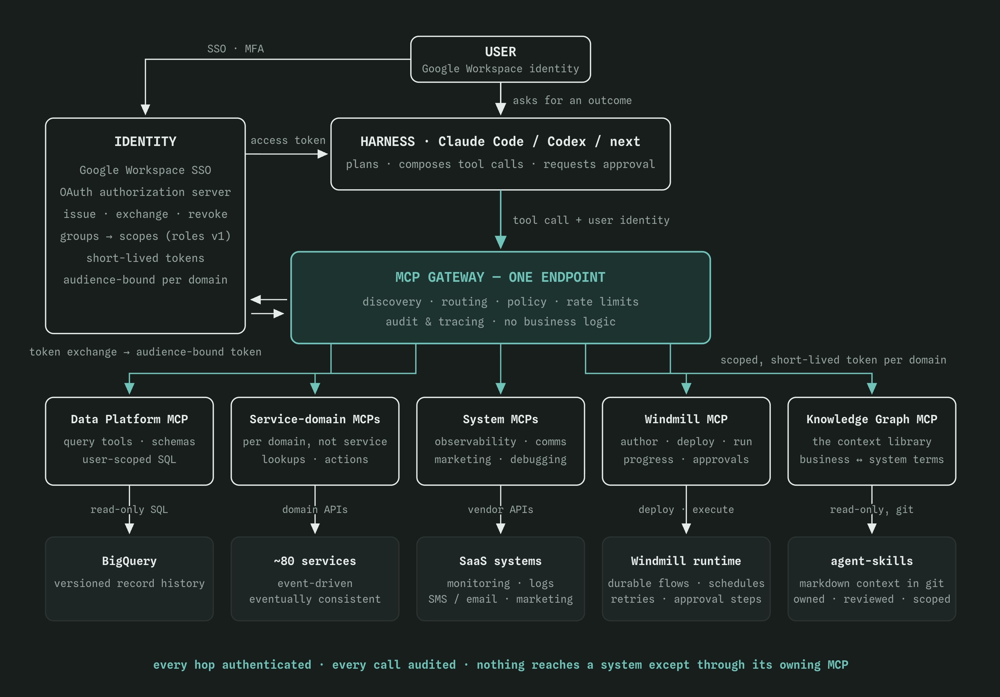

<!-- ## Slide (Section: cover) -->
```text
╔═══════════════════════════════════════════════════════════════════════════════════════════════════════╗
║                                                                                                       ║
║     █████╗     ██╗            ███╗   ██╗     █████╗     ████████╗    ██╗    ██╗   ██╗    ███████╗     ║
║    ██╔══██╗    ██║            ████╗  ██║    ██╔══██╗    ╚══██╔══╝    ██║    ██║   ██║    ██╔════╝     ║
║    ███████║    ██║            ██╔██╗ ██║    ███████║       ██║       ██║    ██║   ██║    █████╗       ║
║    ██╔══██║    ██║            ██║╚██╗██║    ██╔══██║       ██║       ██║    ╚██╗ ██╔╝    ██╔══╝       ║
║    ██║  ██║    ██║            ██║ ╚████║    ██║  ██║       ██║       ██║     ╚████╔╝     ███████╗     ║
║    ╚═╝  ╚═╝    ╚═╝            ╚═╝  ╚═══╝    ╚═╝  ╚═╝       ╚═╝       ╚═╝      ╚═══╝      ╚══════╝     ║
║                                                                                                       ║
║   ██████╗     ██╗          █████╗     ████████╗    ███████╗     ██████╗     ██████╗     ███╗   ███╗   ║
║   ██╔══██╗    ██║         ██╔══██╗    ╚══██╔══╝    ██╔════╝    ██╔═══██╗    ██╔══██╗    ████╗ ████║   ║
║   ██████╔╝    ██║         ███████║       ██║       █████╗      ██║   ██║    ██████╔╝    ██╔████╔██║   ║
║   ██╔═══╝     ██║         ██╔══██║       ██║       ██╔══╝      ██║   ██║    ██╔══██╗    ██║╚██╔╝██║   ║
║   ██║         ███████╗    ██║  ██║       ██║       ██║         ╚██████╔╝    ██║  ██║    ██║ ╚═╝ ██║   ║
║   ╚═╝         ╚══════╝    ╚═╝  ╚═╝       ╚═╝       ╚═╝          ╚═════╝     ╚═╝  ╚═╝    ╚═╝     ╚═╝   ║
║                                                                                                       ║
║                                                                                                       ║
║                                                                                    August 2026        ║
║                                                                                                       ║
╚═══════════════════════════════════════════════════════════════════════════════════════════════════════╝
```

Notes:
Open with the thesis, one sentence: every team that owns data, a service, or a system makes it agent-accessible through an MCP it owns; a shared identity layer and a thin gateway make that access governed, scoped, and audited; and on top of it, anyone in the organisation can get dashboards and durable automations by describing what they need. Compliance framing for an FI-supervised business: this is an internal capability story — anything touching credit decisioning or scoring is high-risk AI under the EU AI Act (Annex III §5) and is explicitly out of scope.

---
<!-- ## Slide (Section: ai-native) -->
```text
╔═════════════════════════════════════════════════════════════════════════╗
║                                                                         ║
║                What "AI-native" means in practice:                      ║
║                                                                         ║
║                                                                         ║
║        An employee turns any request into a result:                     ║
║        a question, a report, an action, a job that runs every week.     ║
║        Fast and safe, without giving up control.                        ║
║                                                                         ║
║        Every asset we own is available through one safe path.           ║
║        Your identity decides what you can see and do.                   ║
║                                                                         ║
║                                                                         ║
║                                                                         ║
╚═════════════════════════════════════════════════════════════════════════╝
```

Notes:
The organisations that win the next five years are the ones where an employee's request reaches what it needs with the least friction — without giving up control. Read the four examples out, because the range is the point: a question, a report, an action inside a system, and a job that keeps running every week. Not just asking things — doing them too. That is what "AI-native" means in practice: not more chatbots, but every asset we own reachable through a governed interface, with identity — not habit — deciding who can do what.


---

<!-- ## Slide (Section: section one) -->
```text
╔═══════════════════════════════════════════════════════════════╗
║                                                               ║
║                    SECTION ONE  -  THE GAP                    ║
║                                                               ║
╚═══════════════════════════════════════════════════════════════╝
```

---

<!-- ## Slide (Section: departments outside the core) -->
```text
┌─────────────────────────────────────────────────────────────────┐
│                 BUILT FOR TWO, ASKED BY EVERYONE                │
└─────────────────────────────────────────────────────────────────┘


    Core services were built for the customers and sales.
    Every other department sits outside them.


┌─────────────────────────────┐     ┌─────────────────────────────┐
│       OUTSIDE THE CORE      │     │      WHAT THEY ASK FOR      │
├─────────────────────────────┤     ├─────────────────────────────┤
│  • Finance                  │     │  • data access              │
│  • Compliance               │     │  • ad-hoc reports           │
│  • Marketing                │     │  • automations              │
│  • Customer Support         │ ──► │  • reconciliations          │
│  • Banking Back Office      │     │  • notifications            │
│                             │     │                             │
│  all on third-party SaaS    │     │  all through product & DEV  │
└─────────────────────────────┘     └─────────────────────────────┘


╔═════════════════════════════════════════════════════════════════╗
║  Today the dev backlog is the only door into the platform.      ║
╚═════════════════════════════════════════════════════════════════╝
```

Notes:
Be specific about who the platform serves today. Our services were built around the customer platform and the sales team — those two have integrated services and own their domain APIs. Finance, Compliance, Marketing, Customer Support, the banking back office and the other supporting functions have no integrated services at all. They run their day-to-day work in third-party SaaS tools, and there is no path from those tools into our core platform. So every time they need something from it, they come to product and dev: give me access to this data, build me this report, automate this job, reconcile these two systems, send this notification. Each one becomes a ticket, a context switch for an engineer, and a two-week wait for a ten-minute job. The dev backlog is currently the only door into the platform, and that is the bottleneck this proposal removes.

If anyone asks how big this actually is, use the real figure and its caveat rather than an adjective. The two projects most exposed to inbound requests — DATA PLATFORM and AUTOMATION — took 384 issues in the last 90 days, roughly 128 a month, with another 96 through IT Support. Be straight about what that is: Jira is organised by product domain, so those totals include each team's own planned work too, and nothing in Jira attributes a ticket to the department that asked for it. So it is the pool this platform draws from, not a measured count of ad-hoc requests. If they want the precise number, the answer is that we add a label for inbound requests and have it within a quarter — and offering that is more credible than guessing at a percentage here.

---

<!-- ## Slide (Section: harnesses) -->
```text
┌─────────────────────────────────────────────────────────────────┐
│                     THE HARNESSES GREW UP                       │
└─────────────────────────────────────────────────────────────────┘


            Claude Code  ·  Codex  ·  whatever comes next

                                │
                                │
                                ▼

        understand  ·  discover  ·  plan  ·  recover  ·  ask


╔═════════════════════════════════════════════════════════════════╗
║      The reasoning half of the problem is already solved.       ║
╚═════════════════════════════════════════════════════════════════╝
```

Notes:
Walk the five verbs on the bottom line, one at a time — this slide is deliberately bare so the talking does the work.
- understand: the user types plain language, the harness turns it into a technical goal. Nobody writes SQL or reads an API doc.
- discover: it reads tool schemas at runtime, so it finds the right call instead of being hard-coded to one.
- plan: it composes multi-step work across several systems, not one request at a time.
- recover: transient failures get diagnosed, adjusted, and retried rather than dumped on the user.
- ask: anything consequential stops and waits for explicit human approval. This is the property that makes the whole proposal safe, so land it hardest.
The point to close on: this is not a novelty chatbot, it is an orchestrator, and the reasoning half of the problem is already solved for us by vendors. We do not have to build it. What we have to build is the access layer underneath it, which is the rest of this deck.

---

<!-- ## Slide (Section: access) -->
```text
┌─────────────────────────────────────────────────────────────────┐
│                        THE CORE PROBLEM                         │
└─────────────────────────────────────────────────────────────────┘


        DEMAND                                     CAPABILITY
                ────────────►     ?     ◄────────────

                          NO GOVERNED PATH


        So the value leaks the worst possible way:
        copy-paste · ad-hoc credentials · scripts on laptops


╔═════════════════════════════════════════════════════════════════╗
║     The missing piece is not intelligence.  It is ACCESS.       ║
╚═════════════════════════════════════════════════════════════════╝
```

Notes:
Put the last two slides side by side. The demand is real and it all queues behind one backlog. The capability is here and it is ready today. They never meet, because the missing piece is not intelligence — it is access. There is no governed path between the harnesses and the things they would read or act on. So today, value leaks through the worst possible channel: copy-paste into chat windows, ad-hoc credentials, one-off scripts on laptops — exactly the pattern our AI policy exists to prevent, happening informally because no sanctioned path exists.

---

<!-- ## Slide (Section: section two) -->
```text
╔═══════════════════════════════════════════════════════════════╗
║                                                               ║
║              SECTION TWO  -  WHAT WE ALREADY OWN              ║
║                                                               ║
╚═══════════════════════════════════════════════════════════════╝
```

---

<!-- ## Slide (Section: estates) -->
```text
┌────────────────────────────────────────────────────────────────────────────────────────────────┐
│                              WE ALREADY HAVE THE BUILDING BLOCKS                               │
└────────────────────────────────────────────────────────────────────────────────────────────────┘


┌─────────────────────┐  ┌─────────────────────┐  ┌─────────────────────┐  ┌─────────────────────┐
│    DATA PLATFORM    │  │       SERVICES      │  │       SYSTEMS       │  │       WINDMILL      │
├─────────────────────┤  ├─────────────────────┤  ├─────────────────────┤  ├─────────────────────┤
│  GCP · BigQuery     │  │  ~80 active repos   │  │  SaaS tools         │  │  orchestration      │
│                     │  │                     │  │                     │  │                     │
│  versioned rows     │  │  event-driven       │  │  finance            │  │  durable runs       │
│  full history       │  │  domain APIs        │  │  marketing          │  │  schedules          │
│  facts · models     │  │  own their data     │  │  compliance         │  │  approval steps     │
│                     │  │                     │  │  customer support   │  │                     │
│                     │  │                     │  │  banking back office│  │                     │
└─────────────────────┘  └─────────────────────┘  └─────────────────────┘  └─────────────────────┘
           ▲                        ▲                        ▲                        ▲
           └────────────────────────┴───────────┬────────────┴────────────────────────┘
                                                │
┌───────────────────────────────────────────────┴────────────────────────────────────────────────┐
│                                        KNOWLEDGE GRAPH                                         │
│                      agent-skills  ·  markdown context, versioned in git                       │
├────────────────────────────────────────────────────────────────────────────────────────────────┤
│  business capabilities  ·  products  ·  journeys  ·  systems  ·  governance                    │
│  scoped Shared · Enklare · Entra      owned files, review dates, access matrix                 │
│  the MCPs read it to turn a business request into the right calls                              │
└────────────────────────────────────────────────────────────────────────────────────────────────┘


╔════════════════════════════════════════════════════════════════════════════════════════════════╗
║                                  We are not starting from zero.                                ║
║                              We are connecting what already exists.                            ║
╚════════════════════════════════════════════════════════════════════════════════════════════════╝
```

Notes:
We are not starting from zero — the raw material already exists in four estates. The Data Platform in GCP builds versioned records of every row, so "how did this change over time" is a first-class question, already built. Roughly 80 event-driven services own their domains (eventually consistent — the MCPs must say so honestly). The SaaS estate covers the highest-frequency requests: observability answers and communication actions. And Windmill is the durable execution plane the harness lacks: the harness plans, Windmill runs things durably and deterministically.

The fifth block is the knowledge graph and skills work in `agent-skills`, which had its own session — do not re-sell it here, just place it in the architecture. One line is enough: that context library is what an MCP reads to turn a business request into the right calls, and it is governed the same way the rest of this is, with owned files, review dates and an access matrix. If someone asks for the detail, it is a separate deck. Keep the room on the MCP model.

---

<!-- ## Slide (Section: identity reality) -->
```text
    ┌───────────────────────────────────────────────────────────────────┐
    │                  ONE IDENTITY, ZERO AUTHORIZATION                 │
    └───────────────────────────────────────────────────────────────────┘


              ┌─────────────────────────────────────────┐
              │                 IDENTITY                │
              │         Google Workspace sign-in        │
              │      one strong identity per person     │
              └─────────────────────────────────────────┘


              ┌─ ─ ─ ─ ─ ─ ─ ─ ─ ─ ─ ─ ─ ─ ─ ─ ─ ─ ─ ─ ─┐
                             AUTHORIZATION
              │              M I S S I N G              │
                   who may see what · who may do what
              └─ ─ ─ ─ ─ ─ ─ ─ ─ ─ ─ ─ ─ ─ ─ ─ ─ ─ ─ ─ ─┘


    ╔═══════════════════════════════════════════════════════════════════╗
    ║     The missing piece is not AI tooling. It is authorization.     ║
    ╚═══════════════════════════════════════════════════════════════════╝
```

Notes:
Everyone signs in through Google Workspace — a single, strong identity for every person. That block is solid. The block under it does not exist: we have no organisation-wide role and access model. Some services carry domain-local roles; they don't compose, and nothing outside those services can reason about them. So the missing piece is not AI tooling — it is authorization. Any serious agent platform forces us to answer "who may see what, who may do what" in a machine-readable way. That investment is overdue regardless of AI: it pays off for every integration, every audit, and every DORA conversation we will ever have. This proposal treats it as the foundation, not a footnote.

---

<!-- ## Slide (Section: section three) -->
```text
╔═══════════════════════════════════════════════════════════════╗
║                                                               ║
║                 SECTION THREE  -  THE PLATFORM                ║
║                                                               ║
╚═══════════════════════════════════════════════════════════════╝
```

---

<!-- ## Slide (Section: three pillars) -->
```text
┌──────────────────────────────────────────────────────────────────────────────────┐
│                                THE THREE PILLARS                                 │
└──────────────────────────────────────────────────────────────────────────────────┘


┌────────────────────────┐   ┌────────────────────────┐   ┌────────────────────────┐
│    [1] DOMAIN MCPS     │   │      [2] IDENTITY      │   │    [3] THIN GATEWAY    │
├────────────────────────┤   ├────────────────────────┤   ├────────────────────────┤
│  every owning team     │   │  current Auth service  │   │  one endpoint for      │
│  ships an MCP for      │   │  + Google Workspace    │   │  every harness,        │
│  what it owns          │   │  grow for this model   │   │  present and next      │
│                        │   │                        │   │                        │
│  domain-owned          │   │  shared roles          │   │  one entry point       │
│  clear tool contracts  │   │  scoped access         │   │  policy + limits       │
│  safe by default       │   │  short-lived access    │   │  full audit trail      │
│                        │   │  machine identities    │   │  routing only          │
└────────────────────────┘   └────────────────────────┘   └────────────────────────┘


```

Notes:
The build plan in three parts. One: every owning team ships and maintains an MCP for what they own — per domain, not per repo, so ~80 repositories become roughly 8-12 MCPs. Two: identity — our current Auth service and Google Workspace grow to support this model, including groups mapped to scopes, token exchange, and short-lived tokens. Three: a thin gateway — one endpoint, policy, rate limits, audit, and nothing clever inside. Division of labor: the harness orchestrates, the gateway routes, the MCP guards, Windmill executes.

The last line under identity — machine identities — is worth pausing on if anyone asks, because it is what makes Phase 3 legitimate. A scheduled job at three in the morning has no human in the session. Today that means it runs on somebody's personal credentials or a shared service login, which is exactly the pattern we are trying to remove. Once the authorization layer exists, every automation gets its own scoped identity instead: narrow scopes, its own audit trail, and a named human owner. So "who ran this?" has a real answer, and offboarding a person no longer silently breaks or silently inherits their automations.

State the guardrail in the same breath, because it is the obvious follow-up question: an agent identity can never exceed the scopes of the person who created it. It is delegation, not a new privilege class. Machine accounts are the classic way least privilege quietly erodes — broad scopes, no expiry, nobody watching — so they get the same short-lived tokens and the same review cycle as everything else. This belongs in Phase 3 with the write tools, not in the foundation.

---

<!-- ## Slide (Section: governed path) -->
```text
┌─────────────────────────────────────────────────────────────────────────────────────────────────────┐
│                                          ONE GOVERNED PATH                                          │
└─────────────────────────────────────────────────────────────────────────────────────────────────────┘


                                      ┌─────────────────────────┐
                                      │           USER          │
                                      └────────────┬────────────┘
                                                   │  signs in once
                                                   ▼
                                      ┌─────────────────────────┐
                                      │         HARNESS         │
                                      │   Claude Code · Codex   │
                                      └────────────┬────────────┘
                                                   │  user token
                                                   ▼
                                      ╔═════════════════════════╗
                                      ║       MCP GATEWAY       ║
                                      ║  checks the user token  ║
                                      ║   Auth mints a new one  ║
                                      ╚════════════╤════════════╝
                                                   │  new token, minted for that MCP
         ┌────────────────────┬────────────────────┼────────────────────┬────────────────────┐
         ▼                    ▼                    ▼                    ▼                    ▼
┌─────────────────┐  ┌─────────────────┐  ┌─────────────────┐  ┌─────────────────┐  ┌─────────────────┐
│     DATA MCP    │  │   SERVICE MCPS  │  │   SYSTEM MCPS   │  │   WINDMILL MCP  │  │ KNOWLEDGE GRAPH │
│  checks that    │  │  checks that    │  │  checks that    │  │  checks that    │  │  checks that    │
│  new token      │  │  new token      │  │  new token      │  │  new token      │  │  new token      │
└─────────────────┘  └─────────────────┘  └─────────────────┘  └─────────────────┘  └─────────────────┘


       The user token stops at the gateway.
       Each MCP only ever sees a token made for it.
```

Notes:
Walk the swap, not the boxes. The harness sends the user token to the gateway. The gateway checks it, then Auth mints a new short-lived token whose audience is exactly one domain MCP. The gateway sends that new token to the MCP. The original user token never leaves the gateway. The MCP checks the token it received — signature, expiry, scopes, and "was this minted for me?" A Data token is useless against Windmill. That is token exchange, not forwarding.

The knowledge graph sits on the same row for a reason: it is reached the same way as everything else, through its own MCP behind the same gate. Context is not a special case that gets to bypass the model — if a scope does not let you see Entra lending context, the graph will not hand it to you either.

---

<!-- ## Slide (Section: trust chain) -->
```text
┌───────────────────────────────────────────────────────────────┐
│                        THE TRUST CHAIN                        │
└───────────────────────────────────────────────────────────────┘


    ONCE  —  CONNECT IN THE HARNESS
    ────────────────────────────────
    1   Connect the gateway plugin
    2   user signs in               Workspace SSO · MFA
    3   harness keeps that token    for the gateway only


    EVERY CALL AFTER THAT
    ────────────────────────────────
    4   harness sends that token    to the gateway
    5   Auth mints a new token      for one domain only
    6   domain MCP checks the new   scopes · audience · expiry
    7   the system does the work    reachable only via its MCP


╔═══════════════════════════════════════════════════════════════╗
║  The user token never leaves the gateway.                     ║
║  A token minted for one domain is useless against any other.  ║
╚═══════════════════════════════════════════════════════════════╝
```

Notes:
Tell it as two timescales, like the Atlassian plugin. Once: you Connect the gateway in the harness, sign in with Workspace, and the harness keeps a user token meant only for the gateway. After that the user just asks. Every call: the harness sends that same user token to the gateway; Auth mints a new short-lived token for one domain; the gateway sends the new token, not the original; the domain MCP checks it. The user never logs in again. Domain MCPs never show a login. Revoke the user in Workspace and both tokens die.

---

<!-- ## Slide (Section: section four) -->
```text
╔═══════════════════════════════════════════════════════════════╗
║                                                               ║
║                  SECTION FOUR  -  WHAT WE GET                 ║
║                                                               ║
╚═══════════════════════════════════════════════════════════════╝
```

---

<!-- ## Slide (Section: organisation win) -->
```text
┌────────────────────────────────────────────────────────────────────────┐
│                      THE WIN FOR THE ORGANISATION                      │
└────────────────────────────────────────────────────────────────────────┘


    1   NO MORE WAITING IN THE DEV QUEUE
        five departments can get answers themselves

    2   AUTHORIZATION FINALLY EXISTS
        pays off for every integration and every audit, AI or not

    3   SHADOW AI BECOMES AUDITED AI
        less risk than today, not more

    4   AGENTS AND AUTOMATIONS GET THEIR OWN IDENTITY
        not a person's password, and not a shared service login

    5   COMPLIANCE BECOMES ENFORCEABLE
        one audit trail for DORA, minimisation in code for GDPR

    6   WE FIND WHAT A NEW RULE AFFECTS
        ask one question, instead of hunting through 80 repos


══════════════════════════════════════════════════════════════════════════
    reading comes first, in Phase 1   ·   doing things, Phase 3

    Most of this is worth doing even if we never grow the AI part.
```

Notes:
No need to re-argue the pain here — they have accepted it by this point. This slide answers the only question left for a decision-maker: why is this worth doing at all. Take the six one at a time, and do not rush the last line.

Items 1 and 6 are in plain language; 2, 3 and 5 keep the technical names because this room knows them. If anyone outside tech is in the room, gloss them as you go — the plain version of each is below.

One and two are the structural ones. Five departments can help themselves instead of queueing for the dev team. And authorization finally exists — in plain terms, we decide who can see and do what. We do not have that today, and it earns its cost through audits and integrations whether or not the AI part ever grows.

Three and four are the risk ones, and they are the strongest cards in an FI-supervised firm. Shadow AI means the copy-paste into chat windows and the scripts on laptops that are happening now, invisibly — making that visible, scoped and revocable is a reduction in risk, not an addition. And agents and automations get their own identity: a job at three in the morning currently runs on somebody's personal password or a shared one, which is the exact pattern we are removing. If asked, state the guardrail immediately — an automation can never do more than the person who set it up. It is delegation, not a new kind of account.

Five and six carry the compliance weight. Five names both regulations on the slide: the single audit trail is the DORA answer, and returning only the fields a job needs is GDPR data minimisation — enforced in code rather than asserted in a policy. Six is worth explaining slowly, because it sounds small and is not: when a new rule lands — a KKrL change, a new FFFS requirement, an observation from FI — somebody has to work out which systems, flows and fields it touches. Today that means going through eighty repositories and asking whoever remembers. With domain MCPs and the knowledge graph, you ask and get the list. For a firm that takes regulatory change as routine work, this may be the most valuable item on the slide.

Then land the closing line, because it is the one that wins agreement from someone unconvinced about AI: most of this is worth doing even if we never grow the AI part. That separates the durable investment from the part they may still doubt. The phase line above it is there to keep us honest — reading comes first, and anything that changes something waits for Phase 3.

Held back deliberately, for questions rather than assertion:
- Audit and subject-access responses stop being projects. "Who accessed this customer's data in March" is an investigation today; with per-call audit at the gateway it is a query. We field these from FI, from auditors, and as GDPR Article 15 requests, so it is a recurring cost the platform removes as a side effect. Compliance will corroborate this if asked.
- Incident resolution gets faster. Cross-system debugging — logs, services and data reachable in one place — is where these tools are strongest, and shorter incidents matter directly for our reporting obligations. The engineering example on the next slide shows it without naming it.
- Each MCP makes the next one cheaper, because of the starter kit and the standards. Use this if the room is cost-focused: the investment curve bends down rather than repeating.
- Vendor lock-in: MCP is an open standard and the harness is the most replaceable component in the architecture. This came off the slide to make room, and it is answered in full in the objections section of the written proposal.

Two things not to claim, because we cannot back them yet: SaaS licence savings, and recruiting or retention benefits. Both are plausible and neither is evidenced, and putting an unbacked claim next to six defensible ones is where a sceptic will aim.

---

<!-- ## Slide (Section: example prompts) -->
```text
┌───────────────────────────────────────────────────────────────────────┐
│                           ONE SENTENCE AWAY                           │
└───────────────────────────────────────────────────────────────────────┘


    ENGINEERING
    ───────────
        "Find the root cause and stack trace for the latest
        customer portal crash."

    SALES
    ─────
        "Which 5 customers should I call today to maximise
        retention payout?"

    MARKETING
    ─────────
        "Calculate true ROI by joining last month's ad spend
        with closed payouts."

    CUSTOMER SERVICE
    ────────────────
        "Give me a 3-bullet brief on this customer's sentiment
        and open tickets."


    No dashboard hopping. No ticket. No waiting.
```

Notes:
These are concrete examples of what the platform enables. Instead of clicking through 4 different dashboards or asking a data analyst to run a query, anyone in the organisation is just one sentence away from complex, cross-system insights. The platform handles the translation from their natural language into the underlying APIs and databases.

This is the people-side slide, so read the four out and let the room find their own team in one of them — that recognition is what the previous slide cannot buy with any number. Two things to add while they are nodding. First, each of these crosses systems that no single dashboard joins today, which is why they are not solved by another report. Second, and worth saying plainly: you only ever see what your own role allows, so nobody has to wonder whether they are allowed to be looking at something. That is what makes people keep using it rather than quietly going back to asking a colleague.

---

<!-- ## Slide (Section: section five) -->
```text
╔═══════════════════════════════════════════════════════════════╗
║                                                               ║
║            SECTION FIVE  -  GOVERNANCE AND ROLLOUT            ║
║                                                               ║
╚═══════════════════════════════════════════════════════════════╝
```

---

<!-- ## Slide (Section: governance) -->
```text
┌─────────────────────────────────────────────────────────────────────────────┐
│                             GOVERNANCE BY DESIGN                            │
└─────────────────────────────────────────────────────────────────────────────┘


    THE RULE                     WHAT THE ARCHITECTURE DOES ABOUT IT
    ─────────────────────────    ──────────────────────────────────────────

    ISMS 1.4                     every write waits for a human to approve
    our own AI policy            this is the controlled Tier 2/3 path

    GDPR                         each MCP returns only the fields needed
    data minimisation            nothing extra reaches the model

    DORA                         one place to see who accessed what
    ICT risk and resilience      one place to switch that access off

    EU AI ACT                    internal productivity only
    Regulation 2024/1689         a human approves anything with consequence


╔═════════════════════════════════════════════════════════════════════════════╗
║  NEVER through this platform                                                ║
║                                                                             ║
║  ✗  credit decisioning · scoring · customer risk assessment                 ║
║  ✗  automated decisions with legal or financial effect on a customer        ║
║  ✗  customer PII · KYC · AML data into model context                        ║
║  ✗  secrets or credentials in tool outputs                                  ║
╚═════════════════════════════════════════════════════════════════════════════╝
```

Notes:
For an FI-supervised kreditmarknadsbolag this is the compliance story, not a compliance problem. ISMS 1.4 tier controls become enforceable instead of aspirational. GDPR minimisation happens inside each MCP — the one place it can actually be enforced. The per-call audit log sits at the gateway. DORA gets central traceability at the gateway, and harness vendors go on the ICT third-party register. The EU AI Act boundary is architectural: credit decisioning, scoring, or customer risk assessment (Annex III §5, likely high-risk) is out of scope and would need CTO + compliance review as a separate initiative. Compliance sign-off is a Phase 0 deliverable, not an afterthought.

---

<!-- ## Slide (Section: rollout) -->
```text
┌───────────────────────────────────────────────────────────────────────┐
│               READ FIRST  ·  WIDEN NEXT  ·  ACT LAST                  │
└───────────────────────────────────────────────────────────────────────┘


    PHASE 0    FOUNDATION
                identity, token exchange, gateway,
                Connect in the harness, starter kit
                exit ──►  sign in once, token swap works

    PHASE 1    READ-ONLY MVP
                two read-only MCPs
                one real question, end to end
                exit ──►  a colleague gets an answer

    PHASE 2    READ-ONLY MAIN DOMAINS
                top domains, read-only
                dashboards, audit log
                exit ──►  weekly users, zero incidents

    PHASE 3    ACTIONS ARE POSSIBLE
                write tools behind approval gates
                first durable automations
                exit ──►  first action with a full audit trail


═══════════════════════════════════════════════════════════════════════
    Everything starts read-only. Each phase is earned.
```

Notes:
Sequencing is the risk control: each phase is earned by exiting the previous one cleanly, and nothing writes until Phase 3. Phase 0 is plumbing only — identity, token exchange, the gateway, Connect in the harness, and a starter kit. Phase 1 is a read-only MVP: two MCPs and one real question answered end-to-end. Phase 2 widens that to the main domains, still read-only, with dashboards and an audit log. Phase 3 is the first time actions are possible: writes behind approval gates, then the first durable automations.

---

<!-- ## Slide (Section: the ask) -->
```text
    ┌───────────────────────────────────────────────────────────────┐
    │                            THE ASK                            │
    └───────────────────────────────────────────────────────────────┘


    ╔═══════════════════════════════════════════════════════════════╗
    ║                                                               ║
    ║  TODAY  -  IN THIS ROOM                                       ║
    ║  1   your input on the architecture and the model             ║
    ║  2   agreement that this is the direction                     ║
    ║                                                               ║
    ║  NEXT  -  WE COME BACK WITH THE DETAIL                        ║
    ║  3   detailed design, then a roadmap with phases and owners   ║
    ║                                                               ║
    ║  THEN  -  IT BECOMES HOW DEV TEAMS BUILD                      ║
    ║  4   each team owns the MCP for domain they own               ║
    ║  5   agent-accessible becomes part of normal delivery         ║
    ║                                                               ║
    ╚═══════════════════════════════════════════════════════════════╝


    Today we agree the direction. The detail and the roadmap come next.
```

Notes:
End on what this meeting is for, and be precise about it, because the wrong ask here loses the room. Today we want two things: your input on the architecture and the model, and agreement that this is the direction. That is it. We are not asking for a team, a budget, or a date, and we are not asking anyone to approve a plan that does not exist yet.

What happens next is the detail: a proper design, and then a roadmap with phases and owners. We come back with that once the direction is agreed — planning a roadmap before the model is settled would be wasted work.

Then land the part that matters most for the long run. This is not a project that finishes and gets handed over. It becomes how the teams build: owning a domain starts to include owning the MCP for that domain, the same way owning a service already includes owning its API and its tests. Agent-accessible becomes part of normal delivery rather than a separate initiative someone has to fund every year. If they agree to the direction today, that is what they are agreeing to.

---

<!-- ## Slide (Section: architecture diagram) -->


Notes:
This is the full picture they are being asked to evaluate. Walk top to bottom: user signs in once, harness plans, gateway is the one door, Auth mints a short-lived token for one domain, each owning team’s MCP guards that domain. Nothing reaches a system except through its owning MCP. Stay on the rules at the bottom: every hop authenticated, every call audited.

---

<!-- ## Slide (Section: closing) -->
<!-- Raw <pre> instead of a fenced block so the proposal link can sit inside the
     ASCII stage. The runtime allows exactly one visible element per slide, so a
     sibling <p> here would fail the whole deck. -->
<pre><code>    ╔═════════════════════════════════════════════════════════════════════════╗
    ║                                                                         ║
    ║                                                                         ║
    ║                                                                         ║
    ║                                                                         ║
    ║                         The harnesses are ready.                        ║
    ║                The data and the systems are already ours.               ║
    ║                                                                         ║
    ║            What is missing is one governed path between them.           ║
    ║                                                                         ║
    ║               ─ ─ ─ ─ ─ ─ ─ ─ ─ ─ ─ ─ ─ ─ ─ ─ ─ ─ ─ ─ ─ ─               ║
    ║                                                                         ║
    ║             Every team makes what it owns agent-accessible.             ║
    ║                    Identity decides who can do what.                    ║
    ║                                                                         ║
    ║                                                                         ║
    ║                                                                         ║
    ║                                                                         ║
    ╚═════════════════════════════════════════════════════════════════════════╝

                             <a href="./assets/proposal.html" target="_blank" rel="noopener">Read the full proposal →</a>
</code></pre>
