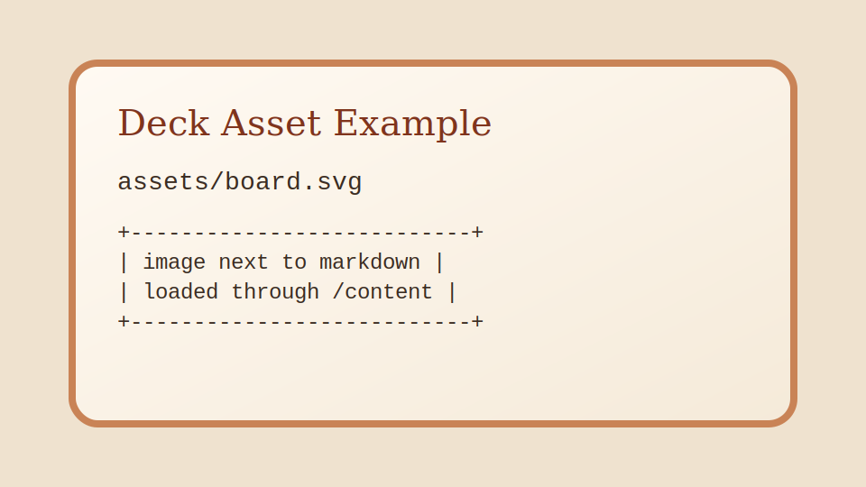

<!-- ## Slide (Section: opening) -->
# System Story

This sample deck shows the markdown structure used by the presentation engine.

- Start each slide with a clear title
- Keep assets next to the markdown file
- Speaker notes use `Note:` or `Notes:`

Notes:
Open the presentation with `/presentation/example`.

---

<!-- ## Slide (Section: diagram) -->
<!-- .slide: data-transition="fade" -->
# Request Flow

```text
+--------+      +-------------+      +-----------------+
| Author | ---> | deck.md     | ---> | Express server  |
+--------+      +-------------+      +-----------------+
                                         |
                                         v
                                  +---------------+
                                  | Reveal.js     |
                                  | markdown deck |
                                  +---------------+
```

Notes:
The markdown plugin keeps the `text` block spacing intact.

---

<!-- ## Slide (Section: animation) -->
# Animated ASCII

<pre class="ascii-morph-stage" data-ascii-morph="moving-block"><code>Loading AsciiMorph…</code></pre>

One short caption: this slide uses AsciiMorph to morph one ASCII diagram into the next.

---

<!-- ## Slide (Section: image) -->
# Folder Assets



One short caption: image paths stay relative to the markdown file.

---

<!-- ## Slide (Section: links) -->
# Useful Links

- [Reveal.js docs](https://revealjs.com/)
- [Example theme override](./assets/theme.css)
- [Presentation index](/)
